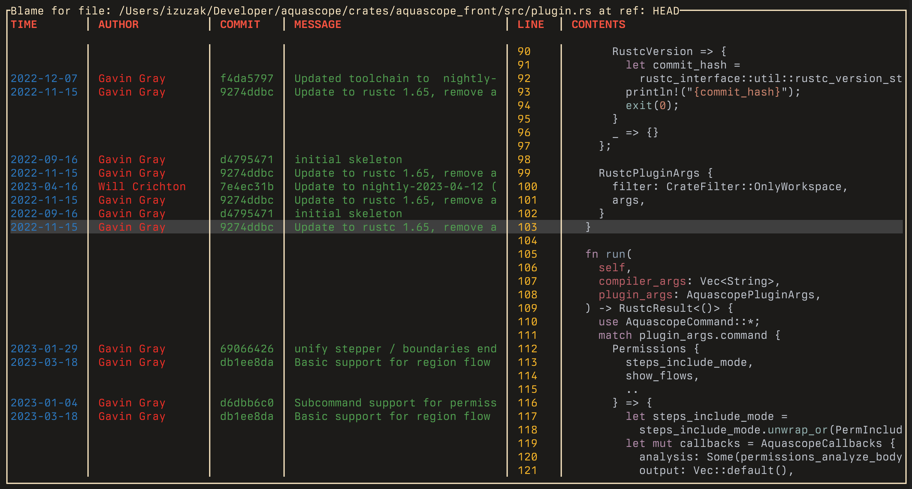

# Blame

A TUI for navigating file blames similar to GitHub's web UI experience.

## Screenshot



## Motivation

This is a toy project to help me learn Rust while building something I find useful.

## Features

* **Syntax highlighting of file contents.** Auto-detects file type based on the file's extension.
* **Easy time travel through the file's blame history.** Move through the file's blame history via the parent-child relationship of each line's commit.
* **Move through blame contents by line or block.** A block is a contiguous group of lines last modified by the same commit.

## Installation

```sh
git clone https://github.com/izuzak/blame
cd blame
cargo build --release
# the target/release directory contains the "blame" binary now
# you can move it to a directory in your PATH or run it directly
```

## Running

```sh
# file - path to a file
# ref - a commit hash, branch, or tag
blame <some/git/repo/filepath> <ref>

# Example: blame the src/main.rs file in the Git repository for the project
blame src/main.rs HEAD
```

## Usage

Keyboard navigation:
* `up` - move selection to line above.
* `down` - move selection to line below.
* `}` - move selection to first line of block above.
* `{` - move selection to first line of block below.
* `left` - travel backwards in time: show the blame for the file at the parent of the commit which changed the current line.
* `right` - travel forwards in time: show the blame for the file and the commit from which we arrived at the current commit.
* `q` - exit the program.

## Dependencies

* [`clap`](https://github.com/clap-rs/clap) - Command line argument parsing.
* [`crossterm`](https://github.com/crossterm-rs/crossterm) and [`ratatui`](https://github.com/ratatui/ratatui) - Terminal user interface.
* [`regex`](https://github.com/rust-lang/regex) - Git blame output parsing.
* [`syntect`](https://github.com/trishume/syntect) and [`ansi-to-tui`](https://github.com/ratatui/ansi-to-tui) - Syntax highlighting.

## Ideas for future work

- Write tests.
- Publish the project on crates.io.
- Show message when trying to navigate to a parent commit when there's no parent.
- Show stack of commits navigated through to reach current commit.
- Indicator for how recent a line's commit was, e.g. by color or some character.
- Jump to a line by number.
- Jump to a line by searching contents.
- File picker for selecting the file for blame.
- Commit picker for selecting the commit for blame.
- Config file for customizing keybindings, colors, columns, and column widths.
- Show/hide columns and change column widths at runtime.
- Show help screen after pressing `?`.
- Loading indicator in case of slow loading in repositories with large histories.
- Open the file, blame or commit in the editor/browser.
- Improve performance:
  - Cache the full file blame so that it doesn't need to be regenerated when re-visiting the same commit.
  - Parse blame info from Git's porcelain blame command, which is intended for machine consumption.
  - Reduce cloning the same information multiple times.
  - Concurrent loading of commit information.

## License

[MIT license](LICENSE)
